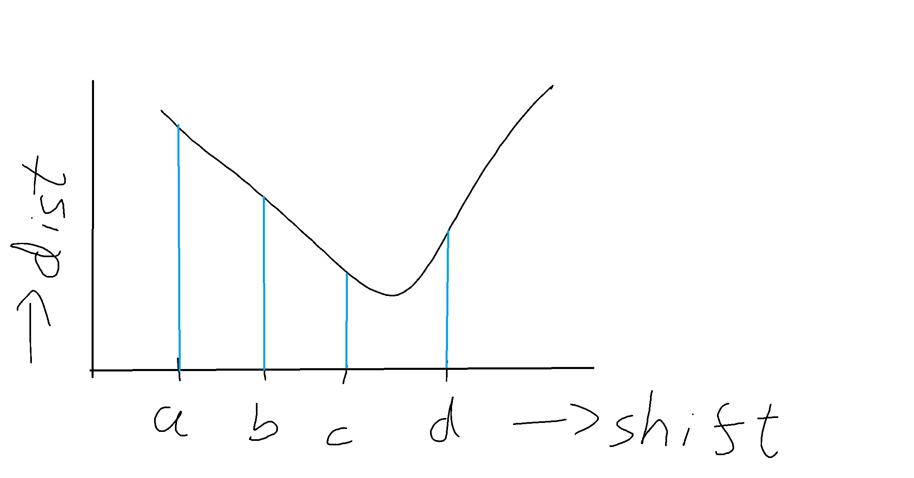
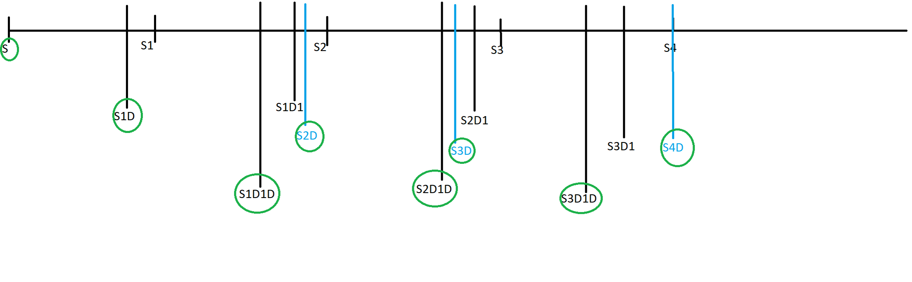
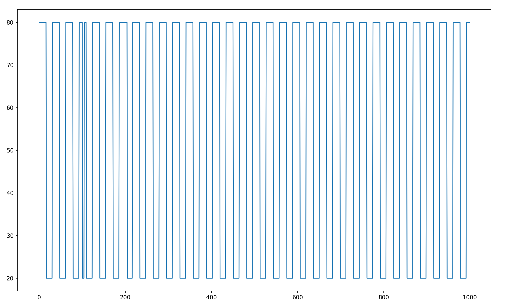
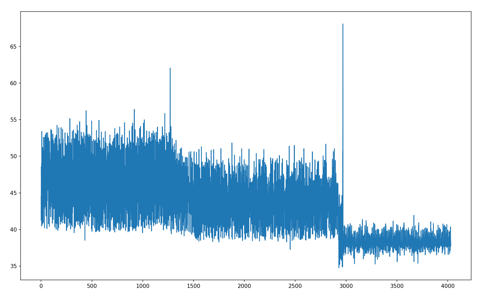
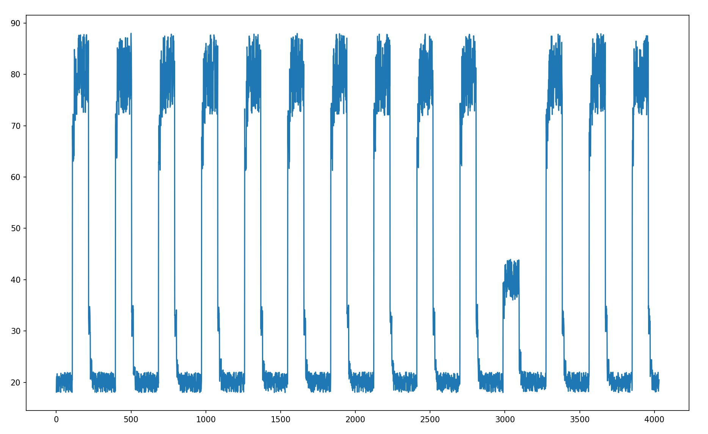
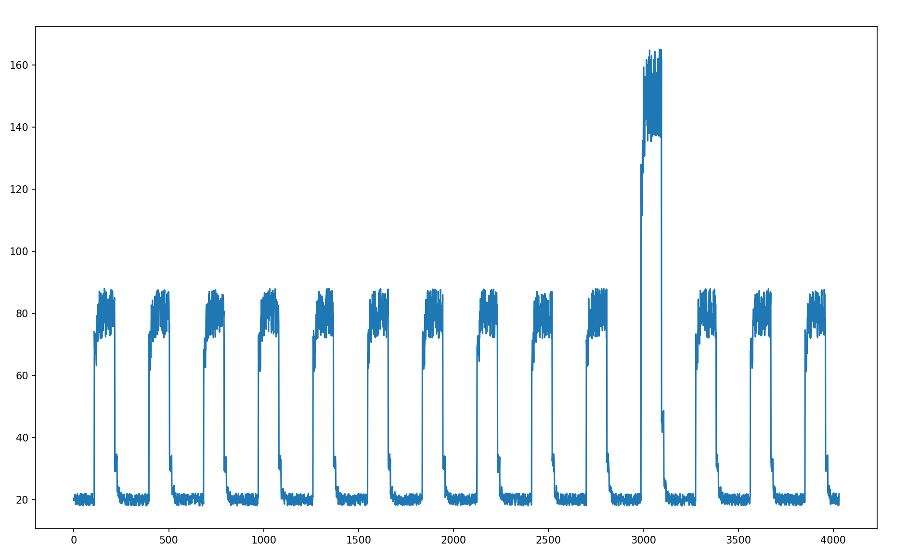

# Introduction to RecurrentClassificationAnomalyDetector

This is machine learning model to detect anomalies in time series dataset using combination of clustering, binary/ternary search, and ad-hoc algorithms.
The model is capable of detecting both segment anomalies (based on pattern match) and point (based on spikes/dips) anomalies.

## Input Dataset

Time series datset.

## Data Preparation

This model works by splitting dataset into segments and using them as datapoints.

## Hight Level Description and Objective of this Model

Main idea is to perform clustering with dataset of segments.
Here each cluster would indicate set of segments with similar pattern.
And segments with anomaly will get separated into clusters of minimal size. 
So our aim is to find an **Optimal Cluster Distribution** which can result anomaly clusters. 
This cluster distribution is determined by various factors
and in most cases does not result correct anomaly clusters, or even result false anomalies. 
These factors include selection of segment length, 
computing distance between segments, 
and threshold used to classify segments to a cluster based on distance.
Large segment length can result pattern anomalies, 
and small segment length can result point anomalies. 
Manhattan distance can be used to calculate distance between segments. 
But this might not work as expected when segments have similar pattern, but are shifted by some length.
Accounting for this shift in length is important to get correct distance. 
Threshold will be used as parameter to compare the distance, 
and segment gets classified to cluster only if distance is less than threshold. 
When classifying a segment, it is possible that distance is less than threshold to multiple clusters. 
Best way to address this conflict is by sorting clusters by their sizes 
and compare distance of segments to clusters one at a time, starting with cluster with smallest size. 
This will ensure clusters with minimal size are real anomalies. 
Finally we still need to filter false anomalies, as anomaly clusters might be formed with segments processed in last iterations 
which have only slightly more distance from non-anomaly clusters.
The overall algorithm also needs good time optimization using binary/ternary search techniques to find optimal cluster distributions and 
calculating segment distances with shift.

## Terminologies

| Term        | Description |
| ----------- | ----------- |
| dataset                       | Dataset representing list of segments prepared by segmentation of time-series data |
| cluster distribution          | Set of cluster sizes and its centers after performing clustering of complete dataset        |
| optimal cluster distribution  | Ideal cluster distribution where non-anomaly datapoints are classified into clusters of large size, and anomaly clusters of minimal size  |
| anomalyRatio                  | Used to identify anomaly cluster size as ratio of size to average cluster size in cluster distribution  |
| threshold                     | distance of segment to the cluster center should be less than or equal to threshold to be classified into cluster |
| optimal threshold             | optimal value of threshold which gives optimal cluster distribution on clustering for given segment length |
| optimal shift                 | optimal length by which segment should be shifted backwards so that its distance from another segment is minimum (for matching pattern distance) | 

## Segment length selection

As the objective is to find both segment and point anomalies. 
Segmentation is done starting with high segment length and reducing it by half on each iteration. 
So this is iterative algorithm to find optimal cluster distribution for given segment length and aggregating results for all segment lengths.

## Clustering algorithm

Given fixed values of: segment length, threshold, and complete dataset.
This algorithm is inspired by standard K-Means / KNN clustering. 
But as anomaly detector is based on repeated classification. 
Our focus is to make this very efficient with average case time complexity O(N).  

The entier dataset is traversed only once through segments separated by sliding length. 
For example if length of dataset is 100. 
Traversal can result into following segments with segment length of 10.  
S1=[0:10], S2=[10:20], S3=[15:25], S4=[23:33], .. ., Sn=[90:100]  
Si indicates ith segment  
and segments can be separated with variable sliding length 
to account for pattern match with shift    
For example if this results into two clusters:  
[S1, S3, .. Sn] [S2, S4 .. Sm]  
The reason why S3 starts from 15 instead of 20 is because pattern [0:10] matches with [15:20]   
When shifting segment [20:30] backwards to [15:20] prevents forming false clusters and in turn prevents forming false anomaly clusters  

NOTE: More details to calculate segments distance along with shift is discussed in further section.  

Clustering algorithm works as per below steps to achieve time complexity O(N*C), where N is number of segments, and C is number of clusters  

**Starting with first segment**  
first segment S1 = [0 : SegmentLength] is used as center of first cluster  

**Classification at ith iteration**  
Compare ith segment (i from 2 to N) with existing centers 
starting with clusters sorted with ascending order. 
This way classification is priotized more for clusters with anomaly size to prevent false anomaly.  

**Maintaining sorted order of clusters**  
Sorting of clusters should not impact time complexity. 
If clusters are sorted in ascending order of size. 
We start with single cluster with S1 on first iteration. 
On ith iteration if new segment gets classified into cluster at index k  
Then size of cluster[K] will increase by one, 
and size of cluster[K+1] can be either equal or more than size of cluste[K], as original cluster distribution is sorted  
So, we check if size of cluster[K] is increased and swap the two cluster positions along with their respective centers 
This way sorting order is maintained throught iterations without any extra overhead. 
This can be illustrated well with below example:  
Consider set of segments [a,b,a,b,b,c,c,c,c], each character representing segments of particulat pattern.  
| Iteration        | Cluster Distribution |
| ----------- | ----------- |
| 1           | [a]         |
| 2           | [a], [b]    |
| 3           | [b], [a,a]  |
| 4           | [b,b], [a,a] |
| 5           | [a,a], [b,b,b] |
| 6           | [c], [a,a], [b,b,b]|
| 7           | [c,c], [a,a], [b,b,b] |
| 8           | [a,a], [c,c,c], [b,b,b] |
| 9           | [a,a], [b,b,b], [c,c,c,c] | 

Notice cluster swapping at iteration 3, 5, 8 and 9

And we do not really store complete list of segment in each cluster in the memory. 
Instead we just store centers and the size of clusters as cluster distribution to achieve good memory optimization. 

## Optimal Cluster Distribution

The result of clustering algorithm in previous section is a cluster distribution. 
And next step is to analyze cluster distribution to check whether anomalies can be extracted 
and changing threshold value in a way that clustering in next iteration has good chance of resulting an optimal cluster distribution.  

With simple observation, we know how changing threshold actually impacts cluster distribution. 
If threshold is 0, resulting cluster distribution has large number of clusters but with very less size. 
If threshold is maximum limit, resulting cluster distribution has single cluster with size of complete dataset. 
This maximum can be easily estimated by aggregating maximum distance of all segments from first segment 
because first segment is center of first cluster by default.

This shows us the general trend:  
Large threshold value results small number of clusters with large size  
Small threshold value results large number of clusters with small size  

None of the above scenario provides optimal cluster distribution  
This can be best illustrated with below table:  

For constant size of dataset, approx = 500
| Threshold        | Cluster Distribution | Average cluster size |
| ----------- | ----------- | ----------|
| 10          | [200, 150, 70, 20, 15, 15, 10, 5, 5, 5, 3, 1] | 38 |
| 1000        | [500]                                         | 500 |
| 100         | [300, 199, 1]                                 | 167 |

From above table, it is not possible to find anomaly clusters for threshold values 10 and 1000.  
But for threshold = 100, it shows 300 segments of similar pattern, and 199 segments of another similar pattern.  
The remaining cluster of size = 1 can be considered as anomaly.  
This is indeed the optimal cluster distribution we want to find.  

Hence, optimal cluster distribution cannot be found using very less or very large value of threshold. 
But can only be found using an intermediate optimal threshold value.  
To find this optimal threshold, we cannot simply iterate through all possible values of threshold and do clustering at each step. 
This will make algorithm too slow.
Binary search algorithm can be used to do this efficiently. 

## Binary Search to find Optimal Threshold

General info about Binary Search  
https://www.hackerearth.com/practice/algorithms/searching/binary-search/tutorial/  
Binary Search is popular algorithm can be used for searching extremum of unimodal function.  

In order to re-structure our problem of finding optimum threshold similar to extremum of unimodal function.  
This algorithm needs to converge between minimum threshold value (0) and maximum threshold value, 
such that we can make decision of increasing threshold limit if it is less than optimal threshold 
and decrease threshold limit if it is more than optimal threshold. 
The maximum threshold limit can be minimum value of threshold which classifies all segments into single cluster.  
Hence we need a rule of convergence.

**Rule of convergence**  
If minimum threshold limit is = minThresholdLimit
and maximum threshold limit is = maxThresholdLimit  
So currentThreshold = (minThresholdLimit + maxThresholdLimit) / 2

General rule of convergence can be if clustering is done using currentThreshold  
**Case 1**  
Increase minThresholdLimit = currentThreshold + 1, if resulting cluster distribution is large number of clusters with small sizes  
**Case 2**  
Decrease maxThresholdLimit = currentThreshold, if resulting cluster distribution is small number of clusters with large sizes  
**Case 3**  
Decrease maxThresholdLimit = currentThreshold, if resulting cluster distribution is optimal  
As this is optimal cluster distribution, we have some chance of finding anomalies  
However, we still do not have guarantee to find ALL anomalies  
Consider below example:  
| Optimal Threshold        | Cluster Distribution |
| ----------- | ----------- |
| 150         | [300, 199, 1] |
| 120         | [300, 100, 97, 2, 1] |

Optimal Threshold = 150, results 1 anomaly cluster, with 1 anomaly point  
Optimal Threshold = 120, results 2 anomaly clusters, with 3 anomaly points  
If dataset has only 1 real anomaly points, then it is included in both cluster distributions. 
If dataset has 3 real anomaly points, then it is included only in cluster distribution of threshold = 120.  

Hence we can consider threshold=120 as more optimal value, 
and if real anomaly is only 1 point, then false anomaly can be filtered using technique discussed in further sections  
And this is reason we should decrease threshold for Case 3 rule of converge.  

**More details on rule of converge**  
The previous section describes rule of converge, but in abstract way based on 
*large number of clusters of small sizes* OR 
*small number of clusters of large sizes* OR 
*optimal threshold case*.
More precisely we need exact logic to estimate these cases.  

This is possible using a new parameter called **AnomalyRatio** 
calculated using formula: 1 / sqrt(size of dataset)  
The value of AnomalyRatio is rough estimate to make decision if size of Cluster A is very less compared to size of ClusterB 
only if (size of ClusterA) < (size of ClusterB) * anomalyRatio  
Taking example to visualize utility:  
If total dataset size = 100, anomalyRatio = 0.1 consider below cluster distributions  
CD1 = [50, 30, 20] , avg size = 33  
CD2 = [50, 45, 5, 5], avg size = 25  
CD3 = [70, 10, 10, 8, 2], avg size = 20  
Now, we can make following decisions:  
for CD1: None of clusters are very less compared to any other cluster  
for CD2: Clusters of size = 5 are very less compared to cluster of size = 50   
for CD3: Cluster of size = 2 is very less compared to cluster of size = 70, and it is also very less compared to avg size  

Elaborating Case 1/2/3 of rule of convergence based on AnomalyRatio  

**Case 1**  
If (average cluster size) < (total size) * anomalyRatio  
This can be interpreted as: large number of clusters with small size  

**Case 2**  
If case 1 and 2 are not true  
This can be interpreted as: small number of clusters with large size  

**Case 3**  
This case is valid only if following three conditions are true:  
-> If at-least one cluster has size less than (average cluster size) * anomalyRatio  
-> If first condition is false for a cluster, then its size should be at-least more than (total size) * anomalyRatio  
this means there should not be any clusters of intermediate size, either it should be good anomaly cluster or good non-anmaly cluster  
-> If sum of anomaly cluster sizes is less than (average cluster size) * anomalyRatio  
this means there are too many anomalies, which is not generally the case  

"ClusterDistributionHasAnomalies" has code implementation to check Case 3

## Computing distance between segments

Distance calculation is essential to do clustering. Since this is how we know if two segments are similar 
and should be added to same cluster.  

As we know that a segment is a subarray of timeseries data. So Manhattan distance can be used to compute distance. 
However we do not know exact length at which particular patter repeates. This may result very high value of Manhattan distance 
if two segments are exactly same but are shifted by some length.  

Consider timeseries dataset defined by following pattern:  
X = []  
 	for i in range(1000) :  
&emsp;  		if (i%31 < 17) :  
&emsp;&emsp;  			X.append(80)  
&emsp;  		else:  
&emsp;&emsp;  			X.append(20)  

The pattern repeats at index multiple of 31. Now Manhattan distance between segments 
X[0:30] and X[33:63] has significant value around 240. But segments are very similar and only shifted by index of 2.  
Like distance between X[0:30] and X[31:61] is 0.  
Hence we need to account for this shift when calculating distance.  

**Computing segment distance with shift**  
Consider two segments to compute distance of equal segment length  
Seg1 = X[start_pos1: end_pos1]  
Seg2 = X[start_pos2: end_pos2]  

Instead of directly calculating Manhattan distance. 
We allow Seg2 to shift by some length backwards, and modified Seg2 will be X[start_pos2 - shift: end_pos2 - shift]  
Brute force way of finding this shift is by keep shifting Seg2 by 1 and calculate distance to Seg1 at each iteration. 
Optimal shift correponds to minimum distance and this is used as actual distance between segments.  

Maximum shift can be upto limit of (segment length) / 2  
And segment length can be reduced by half on each iteration of this algorithm. This way possibility is less that we might miss pattern of particular length.  
For example:  
If length of pattern is x, and we iterate through segment lengths y and y/2 such that: y > x > y/2  
Then pattern will get captured by segments of length y, as they can be shifted backwards by y/2 to match the pattern  
Finding optimal shift by iterating from 0 to (segment length)/2 is not efficient approach. Hence we use ternary search algorithm to find shift in log(N) time complexity.  

## Ternary Search to find optimal shift  

Taking example from previous section:  
Seg1 = X[start_pos1: end_pos1]  
Seg2 = X[start_pos2: end_pos2]  

Objective is to find Seg3 such which is shifted version of Seg2 such that its Manhattan distance from Seg1 is minimum.  
Consider Seg3 = X[start_pos2-shift: end_pos2-shift] = X[start_pos3: end_pos3]  
also it is given that: shift < (segment length)/2  

As we know the shift indicates that Seg2 is similar to Seg1 but only shifted by some length.  
Since Seg3 starting from start_pos2-shift results minimum distance from Seg1 due to pattern matching. Shifting Seg3 either direction will increase its distance from Seg1.  

If Seg3 is shifted by length k to either directions.  
and consider Dist(Seg1, Seg3) is distance from Seg1 and Seg3.  
Then below inequalit holds true:  
Dist(Seg1, X[start_pos3-k: end_pos3-k]) > Dist(Seg1, X[start_pos3: end_pos3]) < Dist(Seg1, X[start_pos3+k: end_pos3+k])  
As the value of k increase, the distance would further increase from Seg1  
If k is increased to greater value k2  
then,  
Dist(Seg1, X[start_pos3-k2: end_pos3-k2]) > Dist(Seg1, X[start_pos3-k: end_pos3-k])  
Dist(Seg1, X[start_pos3+k2: end_pos3+k2]) > Dist(Seg1, X[start_pos3+k: end_pos3+k])  

Hence, the relation of segment distance and shift 'k' can be visualized as unimodel function.  
However this will only work for certain maximum limit of k, after which pattern starts to repeat again.  
And since we do not know this maximum limit, the distance-to-shift realtion could have multiple minima.  

For simplicity, lets assume that maximum value of k (which is (segment length)/2) has only one minima.  
And if minima exists at p which is between 0 - maximum value of k  

Using ternary search we compute segment distance with following shift values:  
a = 0  
b = (maximum shift) / 3  
c = 2*(maximum shift) / 3  
d = maximum shift  
And if corresponding distance with shifts are: adist, bdist, cdist and ddist   

**Rule of convergence**  
Check this method in code: 'GetManhattanDistAndShift'  

if a < b :  
&emsp;				# converge only based on minima found in between window  
&emsp;				# minimas at end of windows might be false positive in case window length is more than pattern length  
&emsp;				if bDist <= cDist :  
&emsp;&emsp;					d = c  
&emsp;				else :  
&emsp;&emsp;					a = b  
			# in this case a = b  
			# resulting values of a,b,c,d can be: a,a,a+1,a+2 OR a,a,a,a+1  
			# hence we can safely converge to single point corresponding to minimum distance  
			else :  
&emsp;				if bDist <= cDist and bDist <= dDist :  
&emsp;&emsp;					d = a # converge to a   
&emsp;				elif cDist <= dDist :  
&emsp;&emsp;					a = c # converge to c  
&emsp;&emsp;					d = c   
&emsp;				else :  
&emsp;&emsp;					a = d   

Above Rule of converge can be visualized as unimodel function of distance-shift with following possibilities:  

#1 When optimal shift is between a and b  
Condition: bdist < cdist  
Converge: d = c  
  

#2 When optimal shift is between b and c  
Condition: bdist and cdist has not relation  
Converge: a = b OR d = c (we do not loose minima in either case as it is still in between b and c, and will get correctly converged in next iteration)  
  

#3 When optimal shift is between c and d  
Condition: bdist > cdist  
Converge: a = b  
  

#4 When adist is minimum, but represents false minima. Hence we do not converge to a OR d  
This is the reason we do not converge to a OR d, instead convergence is done only based on bdist and cdist  
  

This rule of convergence is applicable even if we have multiple minimas within maximum shift  
Because as we converge we keep reducing the shift window, and there should be at-least one window which would accomodate only single minima  
And this is when we successfully converge to most optimal shift  

## Testing ternary search algorithm on sample dataset to find optimal shift  

Consider timeseries dataset defined by following pattern:  
X = []  
 	for i in range(10000) :  
&emsp;  		if (i%310 < 170) :  
&emsp;&emsp;  			X.append(80)  
&emsp;  		else:  
&emsp;&emsp;  			X.append(20)  

Dataset clearly indicates strong patterns repeating at interval of 310.  

And consider two segments starting at start_pos1 = 200 and start_pos2 = 1000 with segmentLength = 500  
Executing distance calculation with optimal shift with below code:  
dist, shift = RecurrentClassificationAnomalyDetector.GetManhattanDistAndShift(X, start_pos1, start_pos2, segmentLen)  

Result is:  
distance = 0, shift = 180  
distance is 0 because both the segments are totally identical only shifted by length = 180  
This can be proved checking modulo values:  
200 % 310 = 200  
1000 % 310 = 70  
When second segment is shifted by 180 towards left, then:  
new value of start_pos2 = 1000 - 180 = 820  
and 820 % 310 = 200 (which is same for first segment)  
Hence by shifting second segment, it gets perfectly aligned with first segment and results distance as 0.  
This is much better than simply computing distance without shift, which would result high distance value, and wrongly indicating that segments are different.  

Below table shows convergence at each iteration, starting with minimum shift limit as 0 and maximum shift limit as segmentLen/2 = 250:  

| a,adist     | b,bdist     | c,cdist     | d,ddist     |
| ----------- | ----------- | ----------- | ----------- |
| 0 , 26400 | 83 , 17880 | 166 , 2520 | 250 , 15000 |
| 83 , 17880 | 138 , 7560 | 194 , 2520 | 250 , 15000 |
| 138 , 7560 | 175 , 900 | 212 , 5880 | 250 , 15000 |
| 138 , 7560 | 162 , 3240 | 187 , 1260 | 212 , 5880 |
| 162 , 3240 | 178 , 360 | 195 , 2700 | 212 , 5880 |
| 162 , 3240 | 173 , 1260 | 184 , 720 | 195 , 2700 |
| 173 , 1260 | 180 , 0 | 187 , 1260 | 195 , 2700 |
| 173 , 1260 | 177 , 540 | 182 , 360 | 187 , 1260 |
| 177 , 540 | 180 , 0 | 183 , 540 | 187 , 1260 |
| 177 , 540 | 179 , 180 | 181 , 180 | 183 , 540 |
| 177 , 540 | 178 , 360 | 179 , 180 | 181 , 180 |
| 178 , 360 | 179 , 180 | 180 , 0 | 181 , 180 |
| 179 , 180 | 179 , 180 | 180 , 0 | 181 , 180 |
| 180 , 0   | 180 , 0   | 180 , 0 | 180 , 0   |

This validates rule of convergence of previous section.  
So optimal shift is converged only in 14 iterations. This would have taken 180 iterations without using ternary search algorithm. 
Because given an unkonwn dataset we do not know pattern length and only option would be to explore the complete window of length = segmentLen/2 towards left direction of second segment.  

## Segment selection algorithm for clustering  

With the knowledge of optimal shift calculation, we can exactly show which segments are choosen as part of dataset to apply clustering.  
Idea is to select shifted segments separated by length of segment length.  
This can be best understood with pseudo code below:  

start_pos = 0  
next_start_pos = 0  
while (start_pos < len(X) - segmentLen) :   
&emsp; if (start_pos > next_start_pos) :  
&emsp;&emsp;	start_pos = next_start_pos  
&emsp;&emsp;	next_start_pos = next_start_pos + segmentLen  
&emsp;	elif (start_pos == next_start_pos) :  
&emsp;&emsp;	next_start_pos = next_start_pos + segmentLen  
&emsp; mshift = (code to get optimal shift corresponding to classification of segment starting from start_pos + segment length to clusters)  
&emsp; start_pos = start_pos - mshift  
&emsp; start_pos = start_pos + segment length	
	
Check below image to visualize segment selection algorithm:  
Time series dataset can be stored as array X[]. The horizontal line represents array indices starting with 0 at right end and increasing towards right direction. 
Hence array index P can be located on line at length=P in right direction.  

* A segment can be identified just by it start position with constant length of segmentLen (which is fixed at this iteration)  
* Initialize start_pos = 0 and next_start_pos = 0
* Select first segment starting at index S=0. And use it as first center of first cluster by default.  
* Current value of start_pos = 0 and next_start_pos = segmentLen    
* Temporatily select second segment at index S1=segmentLen, try doing classification based on existing cluster, if not create new center of new cluster.  
* If we found shift doing clssification of S1, then select segment starting from index S1D = S1 - shift, and use it as real second segment.  
* In parallel keep track of next_start_pos which increments with segmentLen whenever current start_pos is greater than or equals to current next_start_pos.  
* Current value of start_pos = S1D, next_start_pos = segmentLen (as start_pos < next_start_pos)  
* Temporatily select next segment at index S1D1 = S1D + segmentLen, and compute shift after performing clustering  
* Again reduce shift and use real next segment starting at index S1D1D = S1D1 - shift  
* Current value of start_pos = S1D1D, next_start_pos = 2 * segmentLen  
* Select next segment starting at index start_pos = S1D1D + segmentLen  
* But this time start_pos > next-start_pos, so update start_pos = next_start_pos = S2 and compute shift after performing clustering  
* Again reduce shift and use real next segment starting at index S2D = S2 - shift  
* Keep repeating all steps above until we read end where start_pos + segmentLen >= len(X)  
* Note that the selected segments can be identified as points enclosed with green circle from image    

  

Note that segment selection algorithm is based on two conditions:  
Condition1: We want to select shifted segments at each index = m * segment length  
Condition2: Also explore segments from shifted segments separated by segment length  

Condition2 ensures selection of segments of similar pattern are preferred.  
But Condition2 alone will not fetch ideal set of segments, and can potentially result skewed dataset when starting segment is treated as anomaly 
because other segments are adjusted well to form large clusters, OR in case pattern changes at some point.  
Hence we need Condition1 to ensure we do not always select segments of particular pattern, instead select at all index = m * segment length 
when moving forward  

In short, Condition1 creates uniform randomness, and Condition2 creates pattern based selection.  
Expectation is segments of Condition1 will get uniformly classified into clusters.  
And segments of Condition2 will get classified into clusters indicating strong patterns.  

Next step is to apply clustering algorithm which is already discussed in previous section.

## Finding anomaly points  

As the objective is to find optimal threshold corresponding to optimal cluster distribution, going through the process of recurrent classification. 
We may or may not find optimal threshold for particular segment length provided if dataset actually has anomalies.  
If optimal threshold is found then we aggregate all segments which belong to clusters with anomaly size. 
But since cluster distribution only has information of cluster centers and cluster sizes.  
So We do not actually store list of segments into clusters for memory optimization. 
However clustering algorithm is idempotent for same values of segmentLength and threshold. 
Clustering can be performed again with optimal threshold, but this time storing all the segments which belong to clusters of anomaly size. 
These segments can be called anomaly segments.  

Next step is to filter the list of anomaly segments and compare them again with non-anomaly clusters, but with bit higher threshold (example 1.5 * threshold)  
This filtering is necessary because anomaly segments might have slightly more distance from non-anomaly clusters, and could result false anomaly result. 
Hence these segments are removed from list of anomaly segments.  

**Estimating points of anomalies**  
Consider we get list of anomaly segments [AS1, AS2, AS3 ..] for certain value of segmentLength and optimal threshold. 
Anomaly points are estimated to be present at mid point of each segment, 
and filtering out the duplicate points by selecting them at-least at length of segmentLength.  

## Time Complexity analysis  

Consider total size of timeseries dataset as N  
Analysis can be done using pseudocode below:  

Iterate through segment lengths starting with N/10 and reducing by half on each iteration  
&emsp; For each segmentLen:  
&emsp; Find optimal threshold by iterating through threshold between 0 to MaxThreshold using binary search  
&emsp; &emsp; For each threshold:  
&emsp;&emsp;&emsp; Find cluster distribution (which will be in turn used to converge binary search)

Hence overall time complexity =  
(time complexity of segment length iteration)  *
(time complexity of threshold iteration)  *
(time complexity of clustering)  

where:  
time complexity of segment length iteration = log(N)  
time complexity of threshold iteration = log(T)  
Where T is max threshold, and its value is arbitary which depends on dataset variance and proportional to segment length  

Time complexity of clustering can be further divided into:  
time complexity of clustering =  
(time complexity of iterating through segments and comparing them with each centers) *  
(time complexity to compute distance between two segments)  

Time complexity of clustering varies with different values of segment lengths  
Consider 3 cases below:  

**When segment length is large**  
In this case segment length is comparable to N  
And since segment length is large we get less number of segments  
so, time complexity of iterating through segments and comparing them with each centers = c (constant)  
time complexity to compute distance between two segments =  
(time complexity of iterating through each point of two segments) *  
(time complexity of converging optimal shift using ternary search)  
Hence,  
time complexity to compute distance between two segments = N * log(N)  
And,  
time complexity of clustering with large segment length = c * N * log(N) = N * log(N)  

**When segment length is small**  
In this case segment length << N  
So expect large number of clusters (in worst case) ~= N  
time complexity of iterating through segments and comparing them with each centers = N2  

We optimize this by limiting the maximum number of clusters because very large number of clusters will never lead to optimal cluster distribution:  
If number of clusters = M  
total number of segments ~= N  
then,  
AverageClusterSize = N / M  
AnomalyRatio = 1 / (N)1/2  
AnomalyClusterSize = (AverageClusterSize) * (AnomalyRatio) = N1/2 / M  
And,  
AnomalyClusterSize >= 1 (to find anomalies!)  
so,  
(N)1/2 / M >= 1  
Hence, maximum value of M (number of clusters) = (N)1/2  

so new time complexity of iterating through segments and comparing them with each centers = N * N1/2 = N3/2  
And,
time complexity to compute distance between two segments = c (as segment length is too small)  
Hence,  
time complexity of clustering with small segment length = c * N3/2 = N3/2  

**When segment length is intermediate**  
This is the case where both (time complexity of iterating through segments) and (time complexity to compute distance between two segments) are significant but not comparable to N  
So, in this case segment length can be assumed to be ~= (N)1/2  
time complexity of iterating through segments and comparing them with each centers = N3/4  
and,  
time complexity to compute distance between two segments = N1/2 * log(N1/2)  
Hence,  
time complexity of clustering with intermediate segment length = N5/4 * log(N1/2)  

**Overall worst case time complexity**  
Among the three cases above the worst case time complexity for clustering is for segment of small length = N3/2  

Hence overall time complexity =  
(time complexity of segment length iteration)  *
(time complexity of threshold iteration)  *
(worst case time complexity of clustering) 
  
overall time complexity = O(N3/2 * log(N) * log(T))  

## Testing this model on sample datasets  

**Dataset with strong pattern**  
Using timeseries data with regular pattern at length=31 with below code:  
X = []  
for i in range(1000) :  
&emsp;	if (i > 100 and i < 105):  
&emsp;&emsp;		X.append(20)  
&emsp;	elif (i > 200 and i < 205):  
&emsp;&emsp;		X.append(80)  
&emsp;	elif (i%31 < 17) :  
&emsp;&emsp;		X.append(80)  
&emsp;	else:  
&emsp;&emsp;		X.append(20)   

Notice anomaly is injected at 100-105 and 200-205  

  

Result:  
Found anomaly points [112.0, 236.0] for segment length = 100  
Found anomaly points [93.5] for segment length = 25  

**Dataset with spike anomalies**  

  

Result:  
Found anomaly points [] for segment length = 100  
Found anomaly points [] for segment length = 25  
Found anomaly points [1271.0, 1284.0, 1310.0] for segment length = 12  
Found anomaly points [1269.5, 2968.5] for segment length = 3  
Found anomaly points [1270.5, 2969.5] for segment length = 1  

**Datasets with anomaly due to pattern change**  

  

Found anomaly points [2735.5] for segment length = 403  

  

Found anomaly points [3022.5] for segment length = 403  

  

Found anomaly points [3099.0] for segment length = 100  

**Notice that pattern anomalies are found with large segment lengths and spike anomalies are found with small segment length**

