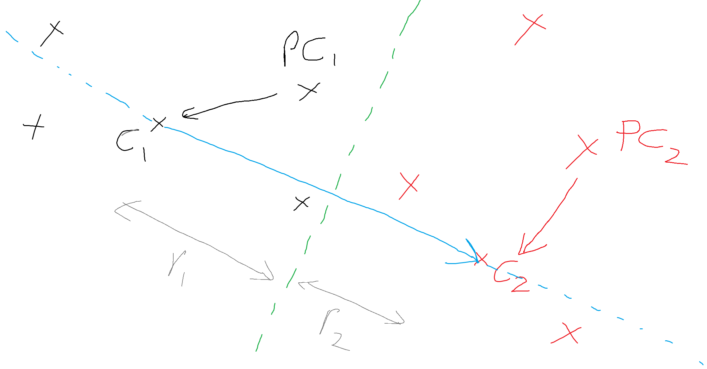

# Introduction to SoftHyperplaneClassifier

This is machine learning model for binary class prediction of linearly separable data similar to standard models like Logistic Regression, SVM etc. 
Equation of hyperplane separating two classes is computed based on vector algebra concepts.
Model parameters are computed by simply traversing dataset, this makes it very efficient with minor tradeoff with accuracy possible with standard algorithms.
Hence this algorithm is different to traditional models which use objective function and use gradient descent to compute weights, and result is again an equation of hyperplane separating two classes.

## Input Dataset

Linearly separable dataset which contains certain number of feature columns with numeric values and another column for binary class for prediction for each data point.

## Documentation

A dataset with N features can be visualized as a set of points in N dimension space.
Each datapoint represents a vector starting from origin to point and would belong to particular binary class.

First step is to find centers of both classes.
These centers will be computed by iterating through dataset and finding mean by aggregating sum of data points of each class and dividing by number of data points in class.
Again centers will represent a two vectors in N dimension space.

Objective of algorithm is to find equation of hyperplane separating two classes preferably with maximum separation possible.
This is achieved using gradient descent to converge objective function using standard ML algorithms like logistic regression, SVM etc.  

Generally equation looks like: Wx + b = 0  
W : model parameters (also called weights)  
x : data point feature values  
b : bias value  
A datapoint belongs to particular class based on result computed with Wx+b as positive or negative.
Basically meaning point belongs to either side of hyperplane.

Using concepts of vector algebra, equation of hyperplane can be determined by its perpendicular line and knowledge of at-least one point from where plane will pass through.
The centers we computed in first step roughly represent the centers of clusters of each class.
And centers are also vectors representing position of clusters in N dimension space.
Since we expect dataset to be linearly separable, the desired hyperplan will exist between two centers and roughly perpendicular to the vector joining them.

If centers are C1 and C2.
Then vector joining centers is C1 - C2.
So at this point we know vector perpendicular to hyperplane.

Next step is to find a point (bias value in terms of standard algos) from where hyperplane will pass through.
If hyperplane passes through C1, model will more accurately predict datapoints of class 2, but very incorrect classification of class1.
Similar case if hyperplane passes through C2.

The best way is to find middle point on line joining C1 to C2, dividing line by inverse ratio of cluster radius parallel to direction of vector C1-C2.
This radius could represent variance of cluster but in direction of vector C1-C2.
Hyperplane passing through this middle point can be used to find most optimal boundary to seperate clusters.

Radius of each cluster is computed as mean distance of datapoints from center in direction of vector C1-C2
For a particular datapoint PC1, this distance is absoulte value of dot product of below vectors:  
distance = abs( (C1 - C2).dot(C1 - PC1) )  

## Results of sample datasets
 
Tested various dataset by dividing into train/test groups and comparing accuracy with logistic regression model of sklearn library in python.

DataSet | Accuracy of logistic regression model of sklearn | Accuracy of SoftHyperplaneClassifier
--- | --- | ---
Iris DataSet https://archive.ics.uci.edu/ml/datasets/iris | 99.9 | 99.9
LinearlySeparableDataSetGenerator https://github.com/Anshul-Solanki/MLAlgos/tree/main/LinearlySeparableDataSetGenerator | 99.9 | 97.5
